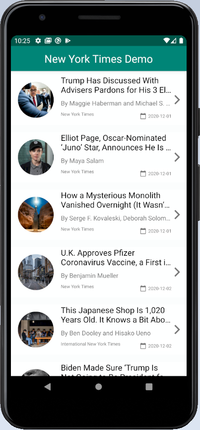

# Most-Popular-Articles-Android
[](https://www.android.com)


Most-Popular-Articles-Android is MVVM sample project which shows popular news which is fetch from NY Times API.

**This application was done using MVVM design pattern including the following :**

- Kotlin - First class and official programming language for Android development.
- MVVM Design Architecture used.
- Android Architecture Components - Collection of libraries that help you design robust, testable, and maintainable apps.
  -  LiveData - Data objects that notify views when the underlying database changes.
  -  ViewModel - Stores UI-related data that isn't destroyed on UI changes.
  -  ViewBinding - Generates a binding class for each XML layout file present in that module and allows you to more easily write code that interacts with views.

- Coroutines - For asynchronous and more..
- Dependency Injection -
  Hilt-Dagger - Standard library to incorporate Dagger dependency injection into an Android application.
- Paging 3
- Retrofit - A type-safe HTTP client for Android and Java.
- Material Components for Android - Modular and customizable Material Design UI components for Android
- Navigation
- Glide
- Data Fetch from NY Times Popular Api
- Test Driven Development(Junit-espresso).


## Screenshots

**Please click the image below to enlarge.**


<p>


</p>


## MVVM Architecture


##  Testing Screenshot


## Contributing

Please fork this repository and contribute back using
[pull requests](https://github.com/mokhtarmoustafa/ny_times_demo_master/pulls).

Any contributions, large or small, major features, bug fixes, are welcomed and appreciated
but will be thoroughly reviewed .

## License

* [Apache Version 2.0](http://www.apache.org/licenses/LICENSE-2.0.html)

```
Copyright 2020 Mokhtar Mostafa

Licensed under the Apache License, Version 2.0 (the "License");
you may not use this file except in compliance with the License.
You may obtain a copy of the License at

 http://www.apache.org/licenses/LICENSE-2.0

Unless required by applicable law or agreed to in writing, software
distributed under the License is distributed on an "AS IS" BASIS,
WITHOUT WARRANTIES OR CONDITIONS OF ANY KIND, either express or implied.
See the License for the specific language governing permissions and
limitations under the License.

